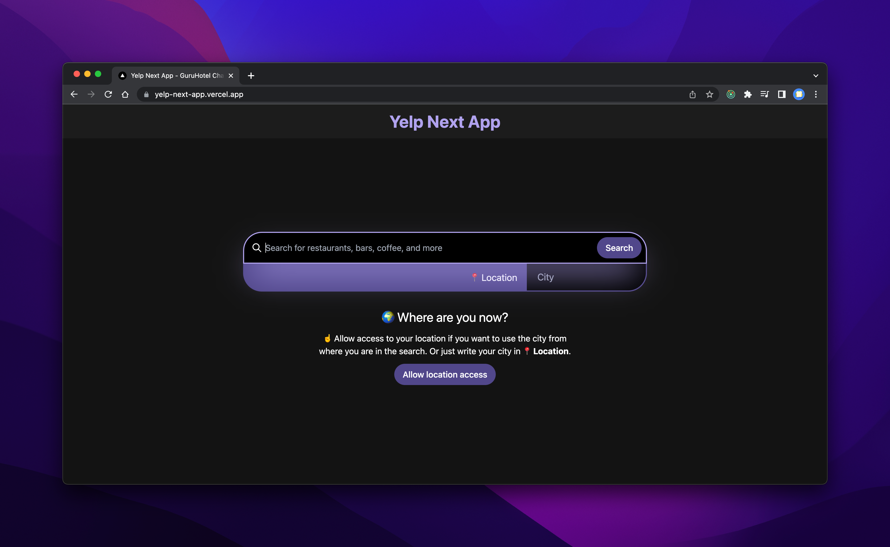
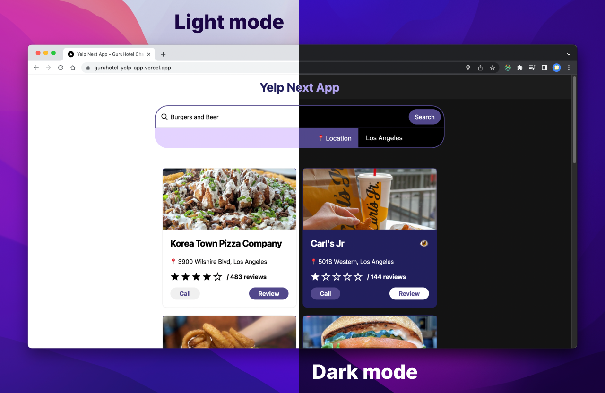
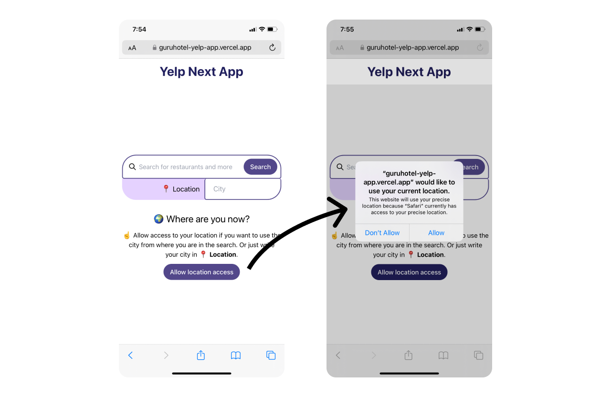

<p align="center">
  <h1 align="center">Yelp Next App - GuruHotel Challenge</h1>
</p>

<p align="center">
  Search for restaurants, bars, coffee, and more
</p>



This is a [Next.js](https://nextjs.org/) project bootstrapped with [`create-next-app`](https://github.com/vercel/next.js/tree/canary/packages/create-next-app).

## Table of contents
1. [Core development](#core-development)
2. [Features](#features)
3. [Screenshots & Design](#screenshots--design)
4. [Set up](#set-up)

## Core development

The development of this project was done using the following technologies:

- Redux for state management.
- RxJS to handle the autocomplete bar data flow.
- PostCSS and TailwindCSS for app layout.
- GraphQL as a query language for information.
- Apollo Client as a library to manage the information.
- ESLint for linting, along with Prettier.
- Playwright for E2E testing.
- GitHub Actions as the CI/CD platform.
- LocalStorage to persist the user's business reviewed history.
- Google LightHouse for performance, SEO and accessibility testing.

📱 **Responsive Design**

Mobile-first approach.

🌗 **Versatile Design**

Light and dark mode are available and based on the user's system preferences. The color palette is updated without the need of reloading the page.

📈 **Over 90% score for SEO, Performance and Accessibility**

It has Google LightHouse integration to ensure that the accessibility, SEO and performance of the application are always at the highest level over 90/100 score. LightHouse is run in the CI/CD pipeline.

🤖 **Multibrowser & Automatic E2E Testing**

Playwright is used to test the main features of the application like the start page, the search bar, the search results, and the business details. Tests are run in different browsers (Chrome, Firefox and WebKit). Tests are run in the CI/CD pipeline.

📄 **Documentation**

The code is documented using JSDoc format. From the API documentation to React hooks.

🚀 **Deployment**

The project is deployed in [Vercel](https://vercel.com/).

## Features

### Basic features

- ✅ The user must be able to see a list with the first 10 results of his search, these results must each have:

  - ✅ Image of the business.
  - ✅ Business name.
  - ✅ Location.
  - ✅ Number of reviews.
  - ✅ Rating.
  - ✅ Contact telephone number.

- ✅ The user can click on a business in the list and must see the full details of the business:

  - ✅ Image of the business.
  - ✅ Business name.
  - ✅ Location.
  - ✅ Rating and number of reviews.
  - ✅ Contact telephone number.
  - ✅ Prices.
  - ✅ Hours.
  - ✅ Open or permanently closed.
  - ✅ List with the first 5 reviews.

**Note 1:** In some business, some properties are not available in the GraphQL response. e.g. `reviews` so I decided to replace the space with the message "This business does not have reviews currently".

**Note 2:** For stetic purposes, I choose not display the contact telephone number in the list, by replacing it with the "Call" button. So the user can call the business directly from the list. But the contact telephone number is still available in the details view.

### Bonus features

- ✅ When the user returns to the main view, the previous search results must be kept and a 👁️ icon must be displayed on the businesses that have already been viewed.
- ✅ Search using the user's current location ([geolocation API](https://developer.mozilla.org/es/docs/Web/API/Geolocation_API)) 🌎
- ✅ A search bar with auto-complete, that is, as the user writes, it shows the list of possible results.

**Note 3:** The geolocalization feature is activated by the user using the button "Allow location access" instead of automatically. I did this because it can be disruptive and interrupt the user's workflow. And [Google Lighthouse](https://developer.chrome.com/docs/lighthouse/overview/) recommends not to use the geolocation API without the user's consent.

## Screenshots & Design







## Set up

First, run the development server:

```bash
npm run dev
# or
yarn dev
```

Copy the content of .env.example to .env:

```bash
cp .env.example .env
```

Fullfill the .env file with the Yelp API Key in `YELP_API_KEY` and with `http://localhost:3000` in `BASE_URL`.

Open [http://localhost:3000](http://localhost:3000) with your browser to see the result.
